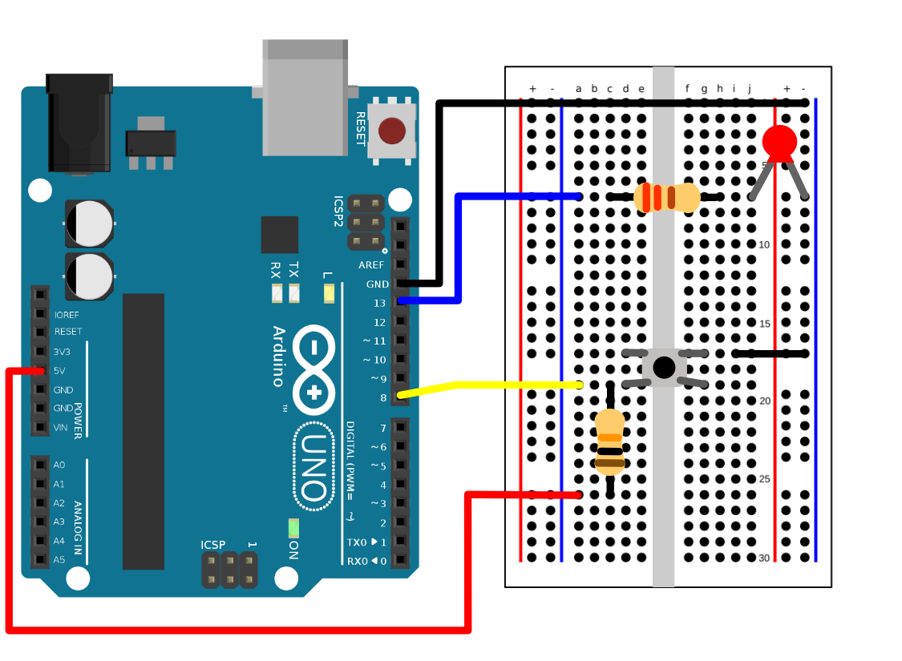

## TinyGo + Arduino = :blue_heart:

---

### Schematic

So my overhead shot with the phone probably wasn't quality.  I should get another DSLR/Mirrorless camera :video: for those overhead shots! Anyway, after editing this video I noticed how it wasn't that clear where I was putting jumper cables, resistors, etc.

---

If you want to support what I do, you can buy me a coffee! :coffee:
[buymeacoffee.com/nerdcademy](https://buymeacoffee.com/nerdcademy)